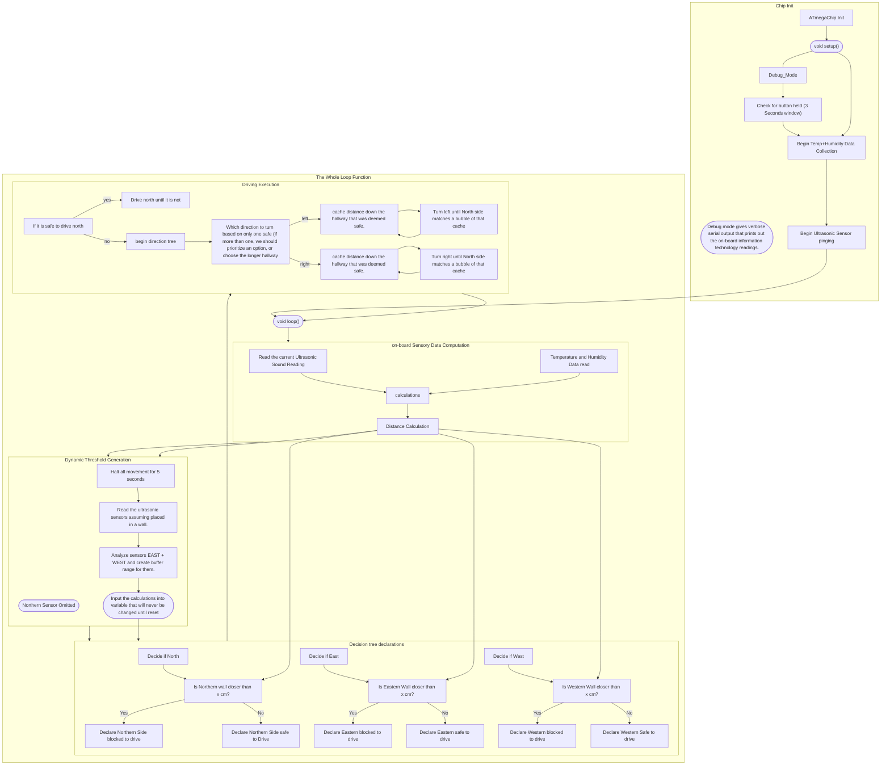

# Wall•E Robot!!
This repository holds the code for a 90° maze-solving robot car. Named after Wall•E because ultrasonic sensors look like the eyes of Wall•E!

# README TODO

- [x] Rudimentary Explanation
- [x] Layout
- [x] Add diagram for logic
- [ ] Add diagram for wiring
- [ ] Grammar check
- [ ] Make repo public

## Purpose

The Robot Script is designed to have a constant flow of four-way proximity between the robot and walls surrounding it.
Using Ultrasonic sound transmitters, we can gather this information every (approx. :/) 2 seconds. Using the temperature sensor, we can calculate proximity using the Speed of Sound.

## Pseudo Logic


If the flowchart does not render, try using the [GitHub Repository Page](https://github.com/colderinit/wall-e). 


Flowchart is newer than the code below.

```cpp
// Note : This logic is really old. Flowchart is newww.
Setup - Set correct pins
Setup - Get Temperature Once. Only once per initialization.
Setup - calibrate motors after a few seconds.
Setup - Define functions that allow for clean turning direction.

Loop - Begin pings
Loop - Make true/false safety statements flow
  in the loop - constantly getting speed of sound
  Gets distance of all four directions (Maybe a key:pair)
  If statement governs safety with proximity threshold 
  [Direction of which the robot came from should be ignored. Or not considered usable unless I add enough complexity to allow for more complex mazes.
  Return safety to go forward, or return a command to turn left or right.
Loop - answer t/f with either driving forward or not | or run the turn funcs
Loop - prioritize driving forward (north in terms of the robot's chassis)
```

## Why?

For a [Destination Imagination Challenge](https://www.destinationimagination.org) :). It also incorporates sound science and mathematics for the execution of movement functions.

### Faq

Are you aware your code is rudimentary?

> Yes, I barely have an idea of how to use a keyboard.
> Jokes aside, I am still a beginner in C++, and I am scared of classes.

What is the total cost if I bought everything as new?

> I am still working that one out. Hold on.

What chip is the hardest to come by?

> I would watch out for Motor Drivers. They are sneaky fellows. 

How do I wire the robot up?

> I forgot to post that. I will do that soon.

# Legal Jargon
`Copyright (c) 2022 Nate Solis`
